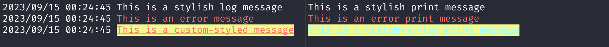

# Agni - Stylish Logging Utility for Go

Agni is a Go package that provides a simple and stylish way to log messages with different text styles and colors. It leverages ANSI escape codes to enhance the appearance of log messages. This README will guide you through the package and how to use it in your Go applications.

## Installation

You can easily install the Agni package using `go get`:

```sh
go get github.com/IsaqueGeraldo/agni
```

Replace `github.com/IsaqueGeraldo/agni` with your desired import path.

## Usage

Agni simplifies logging by offering two main functions:

### Logger

The `Logger` function logs messages with the specified style and sends them to the standard output stream (`log.Println`). Here's how you can use it:

```go
package main

import (
	"fmt"
	"github.com/IsaqueGeraldo/agni"
)

func main() {
	// Logging with default style (no style)
	agni.Logger("This is a stylish log message")

	// Logging with specific style (e.g., bold red text)
	agni.Logger("This is an error message", agni.RedText, agni.Bold)

	// Logging with different styles and colors
	agni.Logger("This is a custom-styled message", agni.CyanText, agni.YellowBackground, agni.Bold, agni.Underline)
}
```

### Println

The `Println` function is similar to the standard `fmt.Println` but allows you to apply styles to your printed messages. Here's how you can use it:

```go
package main

import (
	"fmt"
	"github.com/IsaqueGeraldo/agni"
)

func main() {
	// Printing with default style (no style)
	agni.Println("This is a stylish print message")

	// Printing with specific style (e.g., bold red text)
	agni.Println("This is an error print message", agni.RedText, agni.Bold)

	// Printing with different styles and colors
	agni.Println("This is a custom-styled print message", agni.CyanText, agni.YellowBackground, agni.Bold, agni.Underline)
}
```

## Available Styles and Colors

Agni provides several predefined styles and colors that you can use in your log messages. You can mix and match them to create visually appealing logs. Here are some of the available options:

### Text Styles

- `agni.Bold`: Make the text bold.
- `agni.Underline`: Underline the text.
- `agni.Reverse`: Reverse the foreground and background colors.

### Text Colors (Foreground)

- `agni.BlackText`
- `agni.RedText`
- `agni.GreenText`
- `agni.YellowText`
- `agni.BlueText`
- `agni.MagentaText`
- `agni.CyanText`
- `agni.WhiteText`

### Background Colors

- `agni.BlackBackground`
- `agni.RedBackground`
- `agni.GreenBackground`
- `agni.YellowBackground`
- `agni.BlueBackground`
- `agni.MagentaBackground`
- `agni.CyanBackground`
- `agni.WhiteBackground`

### Reset Style

- `agni.ResetStyle`: Reset the style to default, removing any applied styles or colors.

## Example

Here's an example of what your log messages might look like with different styles and colors:



## License

This package is distributed under the MIT License. See the [LICENSE](LICENSE) file for details.

## Contribution

Contributions are welcome! If you have any improvements, suggestions, or bug reports, please open an issue or create a pull request on the GitHub repository.

## Author

This package was developed by [Isaque Geraldo](https://github.com/IsaqueGeraldo).

---

Enjoy using Agni for stylish and colorful logging in your Go applications!
